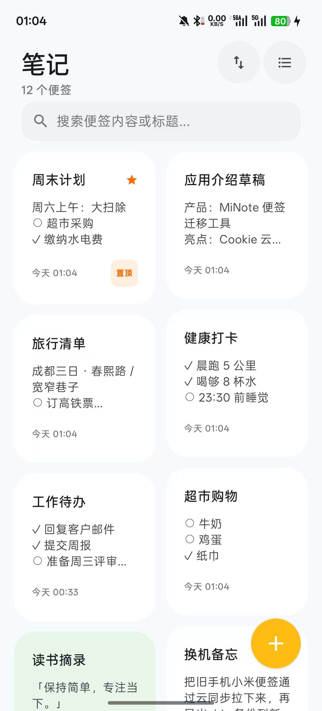
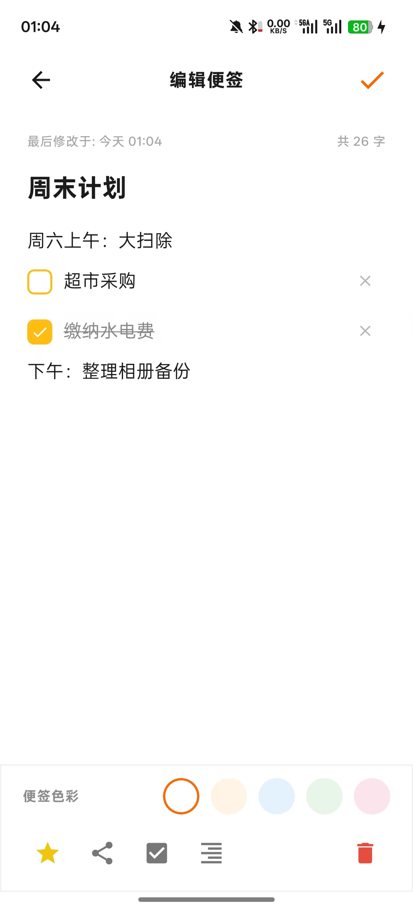
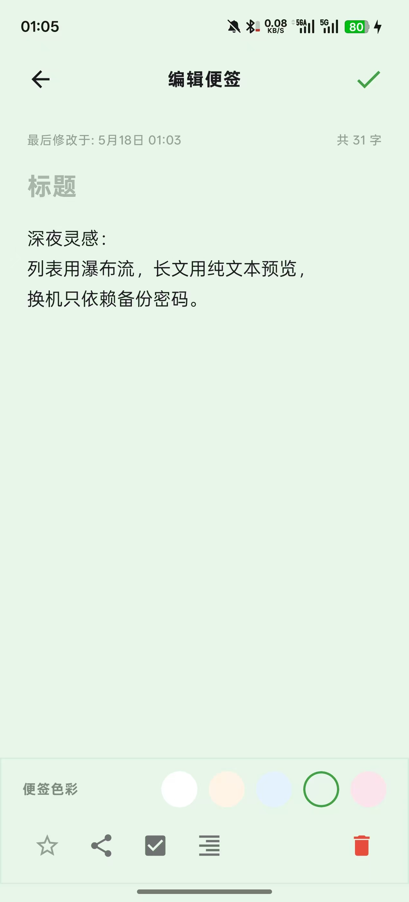
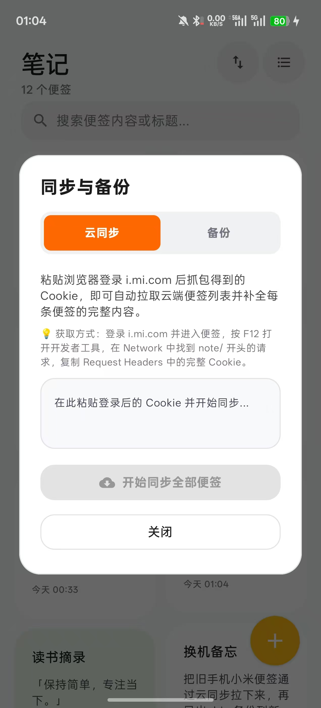
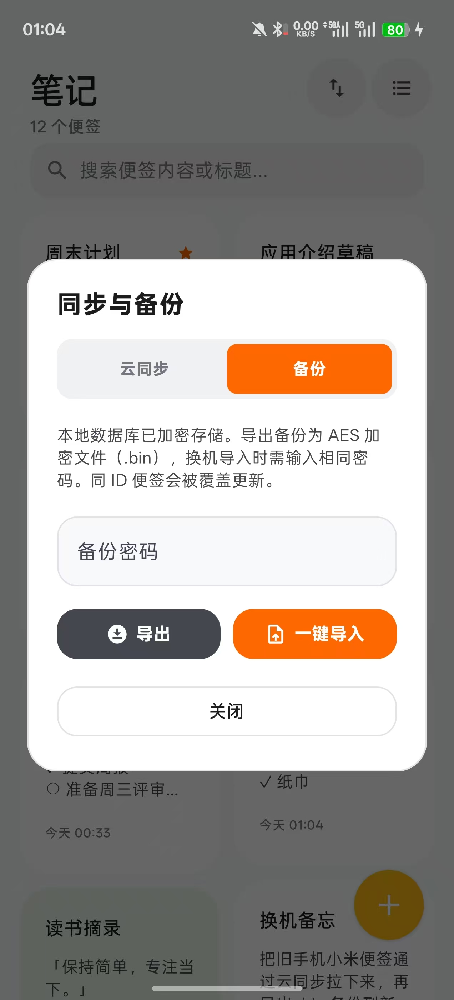
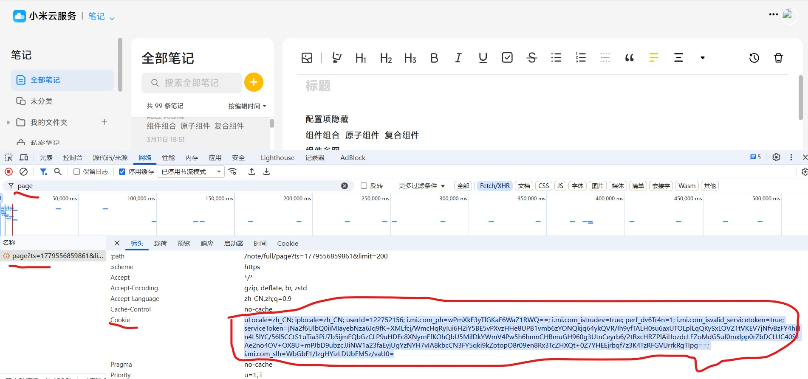

# MiNote

一款用于**从小米云便签迁移便签**的 Android 应用。

## 应用预览

  
  
  

  <em>便签列表 · 待办便签 · 普通便签</em>

  
  

  <em>云端一键同步 · 加密备份导入导出</em>

## 开发背景

我更换了其他品牌手机后，发现大量便签仍留在小米账号里，官方便签**既不好导出，也不方便迁移到新手机**。于是开发了 MiNote，用来：

- 通过 Cookie **一键从 i.mi.com 同步**云端便签到本机；
- **补足小米便签缺少导入/导出**的短板，换机时只需「导出 → 导入」即可带走全部便签。

> **说明：** 当前版本主要支持**不带格式的纯文本便签**（普通文本行、待办勾选等）。复杂富文本排版能力仍在完善中。

## 下载安装

直接下载安装包（无需应用商店）：

**[下载 app-debug.apk](https://github.com/Venshao/MiNote/blob/main/.build-outputs/app-debug.apk)**

安装前请在系统设置中允许「安装未知来源应用」。

## 使用方法

### 1. 从小米云同步便签到本地（推荐首次使用）

把小米账号里的云端便签下载到手机，只需两步：**在电脑上复制 Cookie** → **在 MiNote 里一键同步**。

#### 第一步：在电脑上获取 Cookie

1. 用 **Chrome / Edge** 打开 [i.mi.com](https://i.mi.com)，登录小米账号并进入 **便签** 页面（需能正常看到云端便签）；
2. 按 `F12` 打开开发者工具，切换到 **「网络 / Network」** 面板；
3. 按 `F5` 刷新页面，在请求列表中找到地址包含 `note/` 的请求（例如 `full/page`）；
4. 点击该请求，在 **「标头 / Headers」** → **「请求标头 / Request Headers」** 里找到 **Cookie**；
5. **完整复制** Cookie 的值（整段很长，需一次性全选复制）。

  

> Cookie 相当于登录凭证，请勿发给他人。若提示同步失败，多为 Cookie 过期，请重新登录 i.mi.com 后再复制。

#### 第二步：在 MiNote 中同步到本地

1. 打开手机 **MiNote**，点击右上角 **云同步** 图标；
2. 进入 **「云同步」** 标签页，将 Cookie **粘贴** 到输入框；
3. 点击 **「开始同步全部便签」**；
4. 等待完成：App 会先拉取云端便签列表，再逐条下载完整内容，之后便签会保存在**本地加密数据库**中，可离线查看与编辑。

  

### 2. 备份导出（换机前）

1. 打开 **同步与备份** → **备份** 标签页；
2. 设置 **备份密码**（至少 6 位，请牢记）；
3. 点击 **「导出」**，将便签保存为加密的 `.bin` 文件。

### 3. 备份导入（新手机上）

1. 将导出的 `.bin` 文件拷贝到新手机；
2. 打开 MiNote → **备份** → 输入**与导出时相同的密码** → 点击 **「一键导入」** 并选择文件；
3. 导入完成后便签会写入**本地加密数据库**（相同 ID 的便签会被覆盖更新）。

### 4. 日常使用

- 点击右下角 **黄色按钮** 新建便签；
- 点击便签卡片进入编辑，完成后返回即自动保存；
- 右上角可切换**列表 / 瀑布流**视图，顶部搜索框可检索标题与正文。

## 本地开发

**环境要求：** [Android Studio](https://developer.android.com/studio)

1. 用 Android Studio **Open** 本项目目录；
2. 等待 Gradle 同步完成；
3. 连接真机或模拟器，运行 `app` 模块。

## 开源协议

本项目仅供个人学习与便签数据迁移使用，与小米公司无官方关联。
